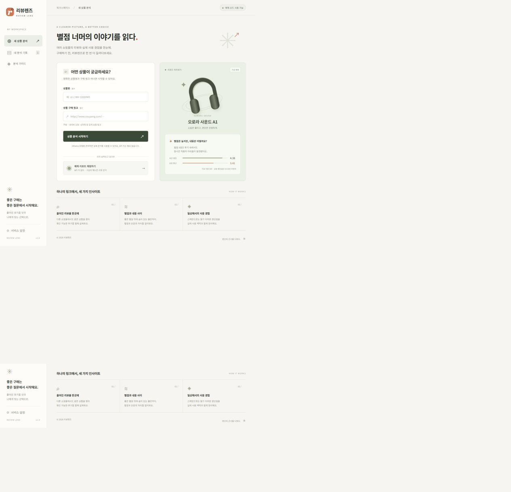

# 리뷰렌즈 · Review Lens

[](https://github.com/Pormer/review-lens/actions/workflows/ci.yml)

**상품명과 구매 링크 하나로, 별점 너머의 이야기를 읽는 리뷰 분석 Agent.**

FastAPI 서버가 무료 웹 검색으로 동일 상품의 정보·리뷰·사용기를 탐색하고, **PC에서 실행하는 Ollama 로컬 AI**가 한국어 리포트로 정리합니다. 기본 모드는 API 키와 호출당 요금이 없습니다. 각 장단점에서 근거와 원래 출처로 이동할 수 있습니다.



## 현재 제공하는 기능

- 정확한 상품명과 쇼핑몰 링크 입력, 비동기 분석 및 단계별 진행 상태
- 무료 웹 검색·공개 페이지 수집 → Ollama 구조화 추출 → 근거 기반 종합 리포트
- 유료 OpenAI Responses API는 명시적으로 선택할 때만 사용하는 선택 기능
- 동일 모델로 분류된 자료 선별, 중복 근거 제거, 출처·발췌·인용 ID 검증
- 상품 정보, 장점·단점, 장기 사용 경험, 적합한 사용자와 구매 전 확인 사항
- **같은 개별 리뷰의 별점과 본문**만 비교하는 감성 괴리 지표
- 근거 필터, 출처 링크, 분석 기록, Markdown/JSON 내보내기, 리포트 삭제
- 키 없이 사용할 수 있는 **가상 상품 예제**와 실제 분석 모드의 명확한 구분
- SQLite 저장, 재시작 시 중단 작업 처리, 작업 시간 제한, 호출량 제한, 접근 키
- 반응형 웹 UI, Docker/Compose, Render 설정, GitHub Actions

> 공개 웹 검색에서 접근 가능한 **부분 근거**를 분석합니다. 쿠팡·네이버·G마켓의 전체 리뷰를 수집하는 전용 크롤러나 공식 리뷰 API 연동은 구현하지 않았습니다. 접근 제한 우회, 구매 인증 보장, 조작 리뷰 판정 기능도 없습니다. 이 한계는 실제 리포트에도 표시됩니다.

## 빠르게 실행하기

Python **3.12**, Git이 필요합니다. 프런트엔드는 빌드 도구나 별도 Node 서버 없이 FastAPI가 제공합니다.

```powershell
git clone https://github.com/Pormer/review-lens.git
cd review-lens
py -3.12 -m venv .venv
.venv\Scripts\python.exe -m pip install -r requirements.lock
Copy-Item .env.example .env
.venv\Scripts\python.exe -m uvicorn app.main:app --host 127.0.0.1 --port 8000 --no-proxy-headers
```

macOS/Linux:

```bash
python3.12 -m venv .venv
.venv/bin/python -m pip install -r requirements.lock
cp .env.example .env
.venv/bin/python -m uvicorn app.main:app --host 127.0.0.1 --port 8000 --no-proxy-headers
```

기존 `.env`가 있다면 덮어쓰지 마세요. Windows에서는 `scripts/run.ps1`로 설치와 실행을 함께 할 수도 있습니다.

- 화면: [localhost:8000](http://localhost:8000)
- API 문서: [localhost:8000/docs](http://localhost:8000/docs)
- 헬스 체크: `/healthz`

화면에서 **예제 리포트 체험하기**를 누르면 외부 API 호출 없이 전체 흐름을 볼 수 있습니다. 예제의 ‘오로라 사운드 A1’과 후기·수치는 모두 가상입니다.

## 실제 상품 분석

Ollama와 로컬 모델을 준비한 뒤 `.env`를 설정하고 서버를 재시작합니다. 상세 설치법은 [로컬 AI 가이드](docs/LOCAL_AI.md)를 참고하세요.

```powershell
ollama pull qwen2.5:3b
```

```dotenv
AI_PROVIDER=ollama
OLLAMA_BASE_URL=http://127.0.0.1:11434
OLLAMA_MODEL=qwen2.5:3b
APP_ACCESS_KEY=충분히_긴_무작위_서비스_접근_키
```

**OpenAI API 키는 필요하지 않습니다.** 설정한 경우에만 서비스 접근 키를 웹 화면의 ‘서비스 설정’에 입력합니다. 이 키는 본인 서버의 접근 제어용이며 과금용 API 키가 아닙니다. Ollama 모델은 최초 다운로드에 수 GB의 공간을 사용하며 실행 속도는 PC 사양에 따라 다릅니다.

1. 정확한 상품명에 모델 번호·세대를 포함합니다.
2. 개인정보나 주문번호가 없는 공개 구매 링크 하나를 넣습니다.
3. ‘상품 분석 시작하기’를 누릅니다.
4. 리포트의 ‘근거·출처’에서 동일 상품 여부와 원래 자료를 확인합니다.

기본 로컬 분석은 무료 검색 최대 3회, 후보 출처 최대 10개, 원문 수집 최대 5페이지, 모델 추출 최대 6개 출처를 대상으로 합니다. 기본 전체 제한은 작업당 600초, 실제 분석 시간당 10건입니다. 검색 결과·접근 정책·모델 출력 품질에 따라 근거를 확보하지 못할 수 있습니다.

선택 사항으로 `AI_PROVIDER=openai`와 `OPENAI_API_KEY`를 직접 설정하면 유료 제공자를 사용할 수 있습니다. 이때만 OpenAI 요금이 발생할 수 있으며, 웹 도구 최대 6회와 구조화 요청 최대 2회를 사용합니다. **로컬 모드가 실패해도 유료 제공자로 자동 전환하지 않습니다.**

## 별점과 내용의 괴리를 계산하는 방법

리뷰의 본문 감성을 `-1 ~ 1`로 추정하고 `3 + 2 × 감성`으로 `1 ~ 5` 범위에 대응시킵니다. **별점과 본문 환산값의 차이가 1.5점 이상**이면 표시합니다. 본문 환산값은 실제 소비자 평점이 아닙니다.

- 별점이 없는 후기와 사용기·상품 스펙은 별점 계산에서 제외합니다.
- 개별 리뷰에 쇼핑몰 전체 평균 별점을 붙이지 않습니다.
- 비교 표본이 3건 미만이면 괴리 비율을 숨깁니다. 10건 미만이면 표본 부족으로 표시합니다.
- 표본 크기·출처·자료 한계를 함께 표시합니다. 지표로 조작이나 허위 리뷰를 단정하지 않습니다.

## 구조

```text
app/
  main.py       HTTP API, 작업 큐, 수명주기, 오류 처리
  agent.py      검색 → 근거 추출 → 종합 분석
  local_agent.py Ollama 로컬 모델 연결
  collector.py  무료 검색, 공개 페이지 추출, 안전한 외부 연결
  models.py     입력 및 AI 출력 스키마
  analysis.py   검증, 중복 제거, 수치 계산
  storage.py    SQLite 작업·리포트·호출량 저장
  demo.py       명시적인 가상 예제
  export.py     Markdown 리포트 생성
  static/       한국어 웹 화면 (HTML/CSS/JavaScript)
tests/          API·분석·외부 응답 모의 테스트
scripts/        실행, 스모크 테스트, GitHub 저장소 준비
docs/           설계, 사용법, 배포, 문제 해결, 게시용 글
```

## 검증

```powershell
.venv\Scripts\python.exe -m pip install -r requirements-dev.lock
.venv\Scripts\python.exe -m pytest -q
.venv\Scripts\python.exe -m ruff check app tests scripts
node --check app/static/app.js
```

`requirements.txt`는 직접 의존성, `requirements.lock`은 실행 시 사용하는 전체 버전 고정 목록입니다. 개발 환경에는 `requirements-dev.lock`을 사용합니다.

외부 API를 모의한 자동 테스트와 실제 API 호출은 서로 다른 검증입니다. 수행한 검증과 남은 외부 설정은 [검증 기록](docs/VERIFICATION.md)에 구분해 적었습니다.

## 문서

- [개발 과정과 코드 설명](docs/DEVELOPMENT.md)
- [API 요금 없는 로컬 AI 설치](docs/LOCAL_AI.md)
- [API 사용법](docs/API.md)
- [Docker·Render 배포 가이드](docs/DEPLOYMENT.md)
- [트러블슈팅](docs/TROUBLESHOOTING.md)
- [검증 및 제출 요건 진행 상태](docs/VERIFICATION.md)
- [티스토리 게시용 개발 후기](docs/BLOG_POST.md)

## 운영 범위와 데이터

이 버전은 **단일 인스턴스·단일 Uvicorn worker**의 소규모 서비스입니다. 작업 큐는 메모리에 있으며 재시작된 작업을 자동으로 다시 과금 실행하지 않습니다. 다중 프로세스·다중 인스턴스로 확장하려면 Redis/외부 큐, 별도 worker, 사용자별 인증과 Postgres 등으로 분리해야 합니다.

상품명·구매 링크·리포트는 기본 7일간 저장하며 시작 시와 API 요청 시 만료 자료를 정리합니다. 삭제는 보관 리포트를 지우지만 호출량 기록은 한 시간 동안 유지합니다. 로컬 모드는 공개 검색 서비스에 검색어를 전송하고 공개 페이지를 읽지만 AI 추론은 PC에서 수행합니다. OpenAI 모드를 직접 선택하면 해당 API에 자료를 전송합니다. 선택 모드의 `store=False`는 Responses 객체 저장 옵션이며 공급자의 모든 보관 정책이 없어지는 것을 의미하지 않습니다.

접근 키를 설정하면 생성·조회·삭제·내보내기를 모두 보호합니다. 사용자별 계정 분리는 없으므로 같은 접근 키를 공유하는 신뢰 그룹용입니다. 리포트 ID는 추측하기 어려운 UUID이며 그 주소를 아는 사람의 접근 가능성을 고려해야 합니다. 키 없는 개발 모드는 로컬에서만 사용합니다.

## 참고한 공식 문서

- [Ollama 구조화 출력](https://docs.ollama.com/capabilities/structured-outputs)
- [DDGS](https://github.com/deedy5/ddgs)
- [OpenAI 웹 검색](https://developers.openai.com/api/docs/guides/tools-web-search)
- [OpenAI 구조화 출력](https://developers.openai.com/api/docs/guides/structured-outputs)
- [FastAPI Docker 배포](https://fastapi.tiangolo.com/deployment/docker/)
- [Render FastAPI 배포](https://render.com/docs/deploy-fastapi)

MIT License · Pormer
