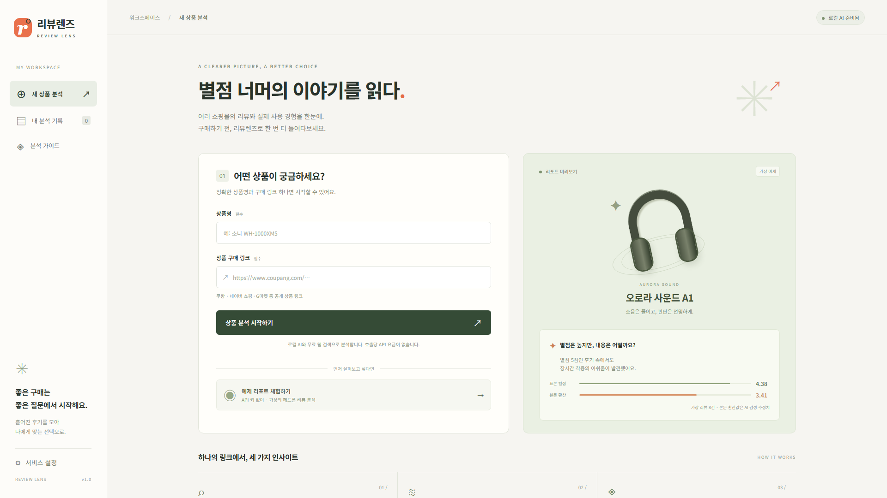
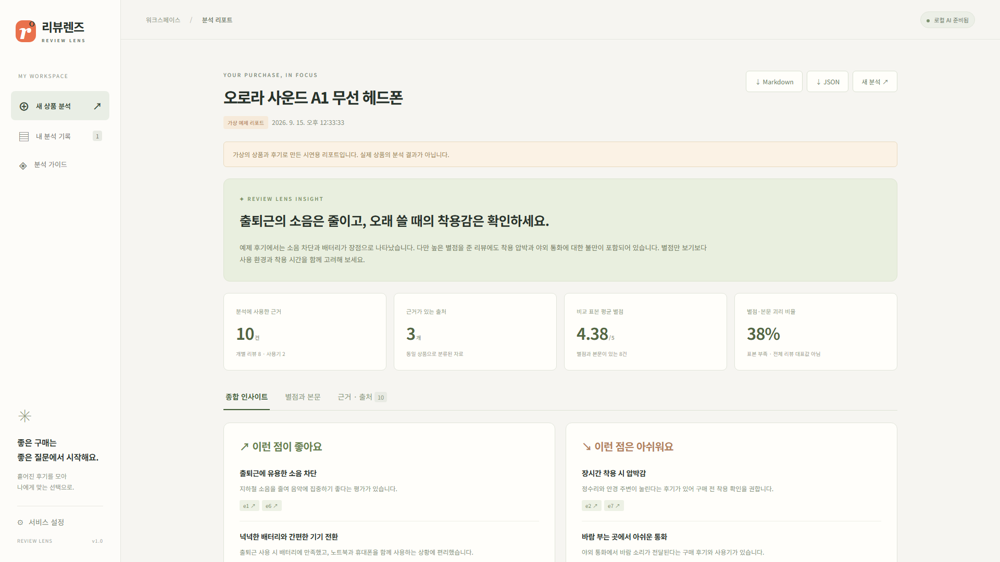

# 별점 5점 뒤의 아쉬움까지: 상품 리뷰 분석 Agent ‘리뷰렌즈’를 만들다

상품을 살 때 별점은 가장 먼저 보게 되는 숫자다. 그런데 별점이 높아도 후기에는 “오래 쓰면 불편해요”, “밖에서 통화할 때 아쉬워요” 같은 이야기가 숨어 있다. 여러 쇼핑몰과 블로그에 흩어진 이런 경험을 한 번에 읽고 싶어 리뷰렌즈를 만들었다.

리뷰렌즈의 입력은 정확한 상품명과 구매 링크 하나다. 서버는 공개 웹에서 동일 상품의 정보를 탐색하고, 리뷰와 사용기를 구분해 장점·단점·실제 사용 맥락을 한국어 리포트로 정리한다. 결과만 보여주지 않고 각 판단이 어떤 근거에서 나왔는지 따라갈 수 있게 했다.



## AI에게 맡길 것과 코드로 계산할 것

전체 흐름은 세 단계로 나눴다.

1. **탐색**: 입력 링크와 같은 모델의 다른 쇼핑몰·사용기를 공개 웹에서 찾는다.
2. **추출과 검증**: 후기 유형, 상품 일치 여부, 별점, 본문 감성을 구조화한다. 출처 ID와 발췌를 검증하고 중복을 제거한다.
3. **종합**: AI가 장단점과 사용 경험을 정리하고, 서버 코드가 표본 수와 별점 괴리 지표를 계산한다.

기술 구성은 FastAPI, Ollama, DDGS 무료 검색, Pydantic, SQLite다. 호출할 때마다 발생하는 API 비용을 피하고 싶어 기본 분석은 PC에서 실행하는 로컬 AI로 구성했다. OpenAI Responses API 연결은 직접 선택할 때만 사용하는 선택 기능으로 분리했고, 로컬 모델이 실패해도 유료 API로 자동 전환하지 않는다. 화면은 별도 빌드가 필요 없는 HTML·CSS·JavaScript로 만들어 한 서버에서 실행된다.

숫자는 AI가 자유롭게 작성하게 두지 않았다. 구조화된 근거에서 계산 가능한 값만 만들도록 했다. 인용 ID가 없는 장단점이나 연구 메모에서 찾을 수 없는 발췌는 제거한다. 그래도 상품 일치와 감성 해석은 모델의 판단이므로, 이 검증이 원문의 사실성까지 보장한다고 설명하지 않는다.

## 별점과 내용의 차이를 어떻게 보여줄까

별점과 본문이 함께 있는 **동일 개별 리뷰**만 비교한다. 본문 감성을 -1에서 1로 추정하고 `3 + 2 × 감성`으로 1~5에 대응시킨다. 실제 별점과 1.5점 이상 차이가 나면 검토할 후기로 표시한다.

예를 들어 별점은 5점인데 본문에서 불편함을 말해 감성이 -0.25로 추정되면, 본문 환산값은 2.5가 된다. 이 차이는 숫자와 글을 같이 읽도록 돕는 신호다. **조작 리뷰를 판별하거나 실제 소비자 평점을 대체하는 점수는 아니다.** 표본이 적을 때는 비율을 숨기거나 표본 부족 안내를 표시한다.



## 없는 데이터를 있는 것처럼 보여주지 않기

쇼핑몰 리뷰는 로그인이나 동적 로딩으로 접근이 어려울 수 있다. 그래서 이번 버전은 공식 리뷰 API나 쇼핑몰 전체 크롤러를 구현했다고 소개하지 않는다. 공개 웹 검색에서 확인할 수 있는 부분 근거를 사용하고, 접근하지 못한 자료는 한계로 기록한다. 구매 인증도 확인되지 않으면 미확인으로 남긴다.

로컬 모델을 설치하기 전에도 화면과 작업 흐름을 살펴볼 수 있도록 가상 상품 ‘오로라 사운드 A1’의 예제를 만들었다. 리뷰 8건과 사용 경험 2건을 사용하며, 화면과 내려받은 리포트에 가상 데이터임을 표시한다. 실제 분석 실패를 예제로 조용히 대체하지 않는다.

## 실행과 디버깅에서 다룬 부분

AI 분석은 일반 웹 요청보다 오래 걸린다. 요청을 받으면 작업 ID를 반환하고 비동기 큐에서 처리하도록 구성했다. 진행 단계와 결과를 SQLite에 저장해 페이지를 닫아도 다시 확인할 수 있다. 서버가 재시작되어 중단된 작업은 자동 재과금하지 않고 중단 이유를 표시한다.

입력 링크 검증, 서비스 접근 키, 시간당 호출량, 작업 제한 시간, 오류 메시지 정리도 추가했다. 비밀 키는 서버 환경 변수에만 저장하며 Git 저장소와 Docker 이미지에서 제외한다.

자동 테스트는 예제 분석 생성부터 조회·내보내기·삭제, 없는 출처와 중복 제거, 부족한 표본, 잘못된 URL, 인증, 한도, 재시작 복구를 다룬다. 외부 API는 모의 응답으로 연결 흐름을 검증했다. 이는 실제 쇼핑몰에서 모든 데이터가 잘 수집된다는 검증과는 다르다.

## 현재 검증한 범위

자동 테스트 48개와 GitHub Actions의 Docker 빌드·컨테이너 실행·예제 스모크 테스트가 통과했다. Ollama 0.34.0과 `qwen2.5:3b` 모델을 설치하고, 실제 상품으로 로컬 분석이 끝까지 실행되는 것도 확인했다. 무료 검색과 접근 가능한 공개 페이지에서는 근거를 수집했지만, 로그인·동적 로딩·사이트 정책 때문에 모든 쇼핑몰 원문을 확보할 수는 없다. 작은 로컬 모델의 상품·자료 유형 분류와 요약도 틀릴 수 있으므로 결과의 원문 발췌와 출처를 함께 확인해야 한다. 공개 호스팅은 보류하고 **현재 PC에서 실행하는 로컬 버전으로 마무리했다.**

[검증 기록과 남은 작업](https://github.com/Pormer/review-lens/blob/main/docs/VERIFICATION.md)

## 실행해 보기

소스와 설치법은 [GitHub: Pormer/review-lens](https://github.com/Pormer/review-lens)에 정리했다. Python 3.12 환경에서 의존성을 설치하고 FastAPI를 실행한 뒤, 브라우저에서 예제 리포트를 먼저 볼 수 있다.

```powershell
Set-Location -LiteralPath '..\Review_Service'
& '.\.venv\Scripts\python.exe' -m uvicorn app.main:app --host 127.0.0.1 --port 8000 --no-proxy-headers
```

현재 PC에는 Ollama와 `qwen2.5:3b` 모델이 설치되어 있어 유료 API 키 없이 실행할 수 있다. PC를 다시 켠 뒤에는 Ollama와 위 서버 명령을 실행하고 `http://127.0.0.1:8000`을 연다. 이 주소는 현재 PC에서만 접속할 수 있다. 자세한 과정은 [로컬 사용 안내](https://github.com/Pormer/review-lens/blob/main/docs/LOCAL_USE.md)에 정리했다. OpenAI API는 자동으로 사용되지 않으며, 추후 직접 요청할 때만 전환한다.

## 앞으로 개선하고 싶은 것

다음 단계는 정당하게 확보한 더 많은 리뷰와 사람이 평가한 검증 데이터다. 감성 임계값을 보정하고, 작성일·사용 기간·협찬 여부를 더 잘 구분하고 싶다. 사용자가 늘면 단일 메모리 큐와 SQLite를 외부 큐·데이터베이스로 분리할 계획이다.

이 프로젝트에서 가장 신경 쓴 것은 그럴듯한 답을 길게 만드는 일이 아니라, **무엇을 근거로 판단했고 무엇은 아직 모르는지 드러내는 것**이다.
