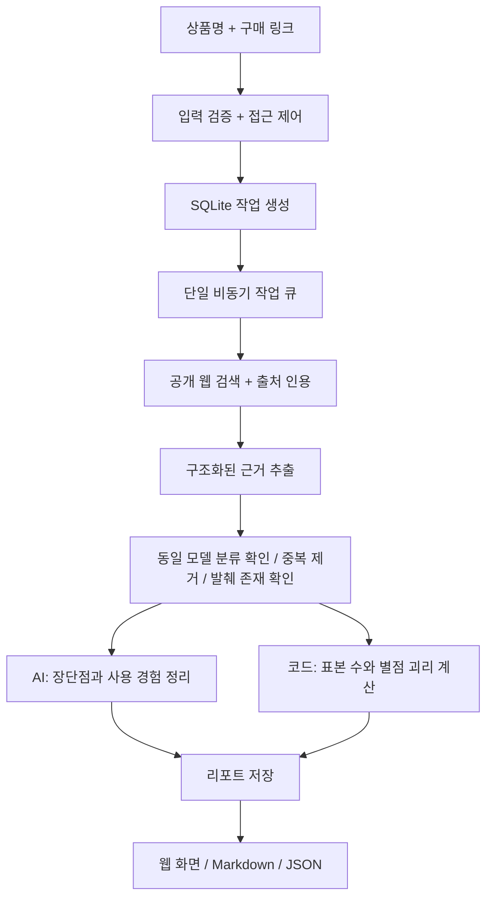

# 개발 과정과 설계

## 문제 정의

높은 별점만으로는 상품의 실제 사용 경험을 충분히 판단하기 어렵습니다. 같은 상품도 판매처마다 리뷰가 흩어지고, 좋은 별점을 남긴 구매자가 본문에서 착용감이나 내구성에 불만을 적을 수 있습니다. 리뷰렌즈는 상품명과 구매 링크를 출발점으로 정보·장단점·별점과 내용의 차이·사용 경험을 한 보고서에 모읍니다.

## 결정 1: 접근 가능한 데이터부터 시작

**기본 실행은 무료 웹 검색 + Ollama 로컬 AI입니다.** 호출당 비용을 원하지 않는 사용 조건에 맞춰 제공자 경계를 분리했습니다. `AI_PROVIDER=ollama`가 기본이고, 유료 제공자로 자동 대체하지 않습니다. OpenAI 연동은 명시적으로 선택하는 선택 기능으로 남겼습니다.

쇼핑몰별 로그인·동적 렌더링·차단 정책을 모두 우회하는 크롤러를 만들지 않았습니다. DDGS 무료 검색과 robots 정책을 확인하는 공개 페이지 추출로 시작하고 확보하지 못한 데이터는 없다고 표시합니다. 검색 결과가 전체 리뷰를 대표하지 않으며 짧은 검색 발췌에 기반할 수 있다는 점도 표시합니다. DNS 검증 후 공인 IP에 연결해 내부망과 재바인딩을 차단하고 원래 호스트의 TLS 인증을 유지합니다.

운영 단계에서 공식 API 또는 계약된 데이터 제공자를 확보한다면, `EvidenceBundle` 구조로 변환하는 수집 어댑터를 추가할 수 있습니다. 수집량을 늘릴 때는 원본 리뷰 ID, 작성일, 모델별 옵션 매칭, 중복 배포 및 협찬 여부를 별도로 다루어야 합니다.

## 결정 2: AI의 역할과 코드의 역할 분리

추가 변경: `naver.py`에 NAVER API HUB 블로그·웹문서 검색 어댑터를 구현했습니다. 키 설정 시 검색은 코드가 API로 처리하고 OpenAI 내장 검색도 생략합니다. `local_agent.py`의 수집 자료 분석 흐름을 두 AI 제공자가 공유합니다. 종료된 쇼핑 검색 API는 포함하지 않습니다. 자세한 기능별 판단과 한계는 [공식 API 전환 문서](OFFICIAL_APIS.md)를 참고합니다. 아래 종전 OpenAI 연구 메모 경로는 공식 키가 없는 `auto` 설정에서만 유지됩니다.

AI는 검색 전략, 상품 일치 여부, 후기 유형·감성, 요약을 담당합니다. 코드가 출처 ID, 메모 내 발췌 존재 여부, 중복, 인용 ID를 검증하고 숫자를 계산합니다. 스키마가 유효하다고 사실까지 보장되는 것은 아닙니다. `product_match=exact`는 AI 분류이며 원문을 독립적으로 재검증하는 시스템은 아직 없습니다.

`agent.py`의 시스템 지침은 로컬·선택형 유료 제공자에서 재사용하며 웹과 사용자 입력을 신뢰하지 않는 자료로 취급하도록 명시합니다. 로컬 모드는 수집한 자료의 발췌, 선택형 OpenAI 모드는 연구 메모 발췌를 사용합니다. 어느 경우에도 실제로 확인한 범위 이상을 원문 인용으로 주장하지 않습니다. 검증하지 못한 출처나 없는 ID를 참조한 항목은 제거합니다.

## 결정 3: 괴리 지표는 설명 가능한 휴리스틱

`analysis.metrics()`는 개별 리뷰 중 별점이 확보된 항목만 모읍니다. 본문 감성 `s`의 대응값을 `t=3+2s`, 차이를 `d=rating-t`로 계산합니다. `|d| ≥ 1.5`면 표시합니다.

예: 별점 5점, 본문 감성 -0.25이면 본문 환산값 2.5, 차이 2.5입니다. 이 결과는 ‘별점과 본문 신호가 다름’을 보여줄 뿐, 허위·조작의 증거가 아닙니다. 3건 미만의 비율은 숨기며, 10건 미만이면 표본 부족으로 표시합니다. 이 임계값과 모델 감성의 정확도는 실제 라벨 데이터로 보정해야 합니다.

## 결정 4: 오래 걸리는 요청을 작업으로 분리

`POST /api/analyses`는 작업 ID를 반환합니다. 브라우저가 `GET /api/analyses/{id}`를 조회해 진행 상태를 표시하므로 한 HTTP 요청을 수 분 유지하지 않습니다. 페이지를 떠나도 작업은 계속 진행되고 기록에서 다시 엽니다.

상태는 `queued → running → completed/failed`입니다. 예외 상세나 키를 사용자에게 내보내지 않습니다. 서버 종료 시 작업을 중단 상태로 기록하며, 재시작 때 남아 있는 미완료 작업을 실패로 정리합니다. 동일 DB에 여러 worker를 띄우면 서로의 작업을 중단 처리할 수 있으므로 **worker=1**을 유지해야 합니다.

## 결정 5: 실제 모드와 예제 모드 구분

API 키 없이도 설치·화면·큐·저장·내보내기를 검증할 수 있도록 가상의 상품과 리뷰 10개를 만들었습니다. 8개는 별점이 있는 리뷰, 2개는 사용 경험입니다. 예제 요청에 사용자가 다른 상품명을 넣어도 서버가 가상 상품명으로 바꿔 실제 상품 분석처럼 보이지 않도록 합니다. 실제 분석이 실패할 때 예제로 자동 대체하지 않습니다.

## 코드 변경을 시작할 위치

| 변경 사항 | 파일 |
| --- | --- |
| 모델, 탐색/추출/종합 지침 | `app/agent.py`, `.env` |
| 입력/출력 필드 | `app/models.py` |
| 감성 기준, 표본 계산, 근거 검증 | `app/analysis.py` |
| 보관 기간, 호출량, 시간 제한 | `app/config.py`, `app/storage.py`, `app/main.py` |
| 화면 및 키보드 탭 조작 | `app/static/app.js` |
| 레이아웃, 모바일 대응 | `app/static/styles.css` |
| 가상 예제와 수치 | `app/demo.py`, `tests/test_analysis.py` |

## 다음 개발 단계

1. 실제 상품 여러 종류에서 출처 일치와 감성 분류를 사람이 평가하는 데이터셋 구축
2. 합법적인 상품별 리뷰 수집 어댑터 및 원본 근거 재검증 추가
3. 사용자 인증과 개인별 접근 제어, Redis 큐, Postgres 분리
4. 출처별 비중·작성일·협찬 여부·사용 기간을 반영하는 분석
5. 비용·지연·실패율 관측, 예산 경보, 운영 백업 및 복구 절차

현재 범위를 넘는 항목은 구현 완료 기능으로 소개하지 않습니다.
